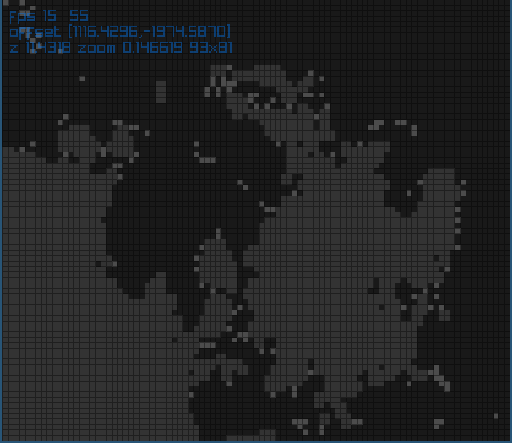
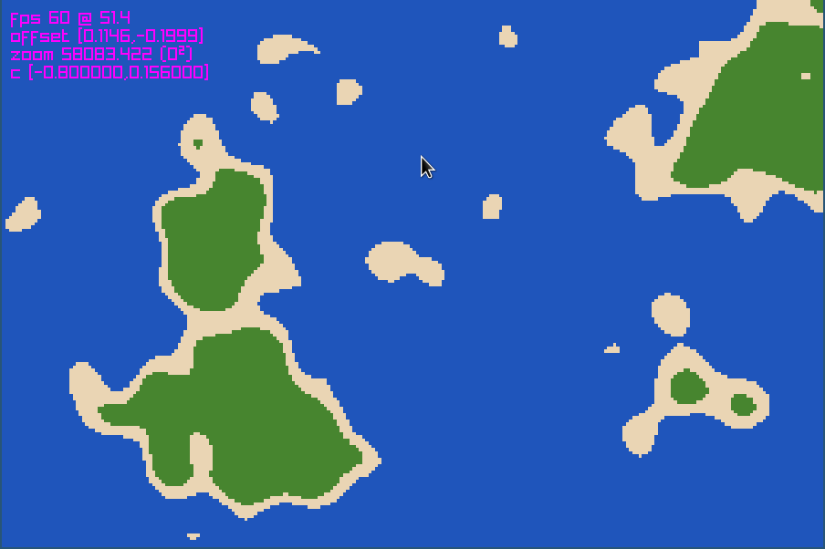

# 2d autoworld

This is a small experiment of mine. This program will let you
experiment with various functions for generating simple 2d box
terrain.

Build with `make`. I'm using the raylib gaming library for everything
graphics-related. The terrain is "generated" (calculated, rather) in
the shader where most of the work is done.

