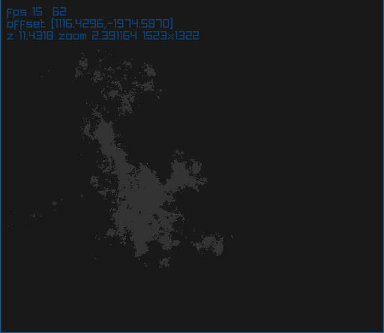

# 2d autoworld

This is a small experiment of mine. I wanted to do a
procedurally-generated-terrain using a Julia Set.

Build with `make`. I'm using the raylib gaming library for everything
graphics-related. The terrain is "generated" (calculated, rather) in
the shader where most of the work is done.

